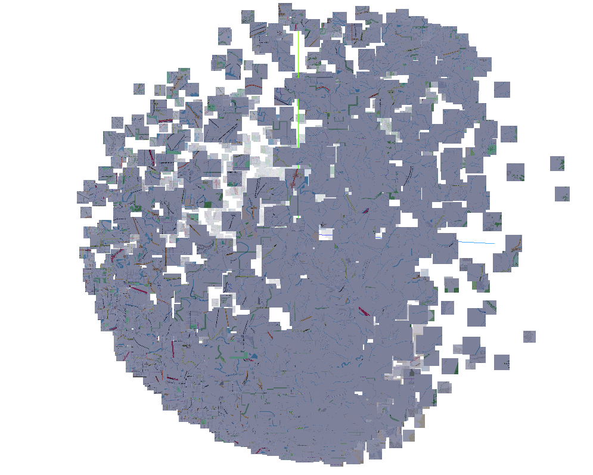
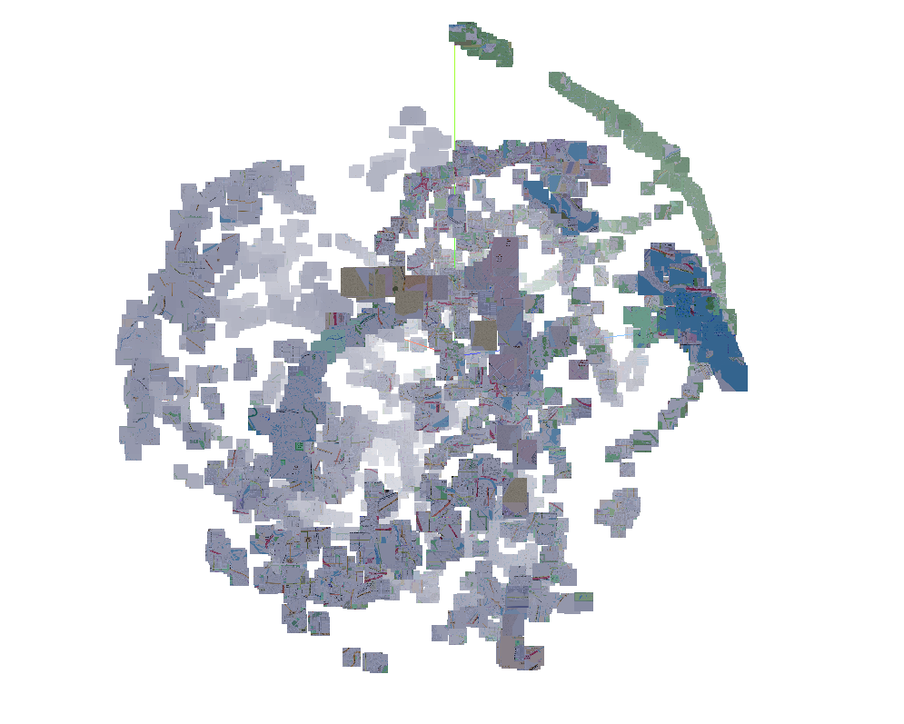
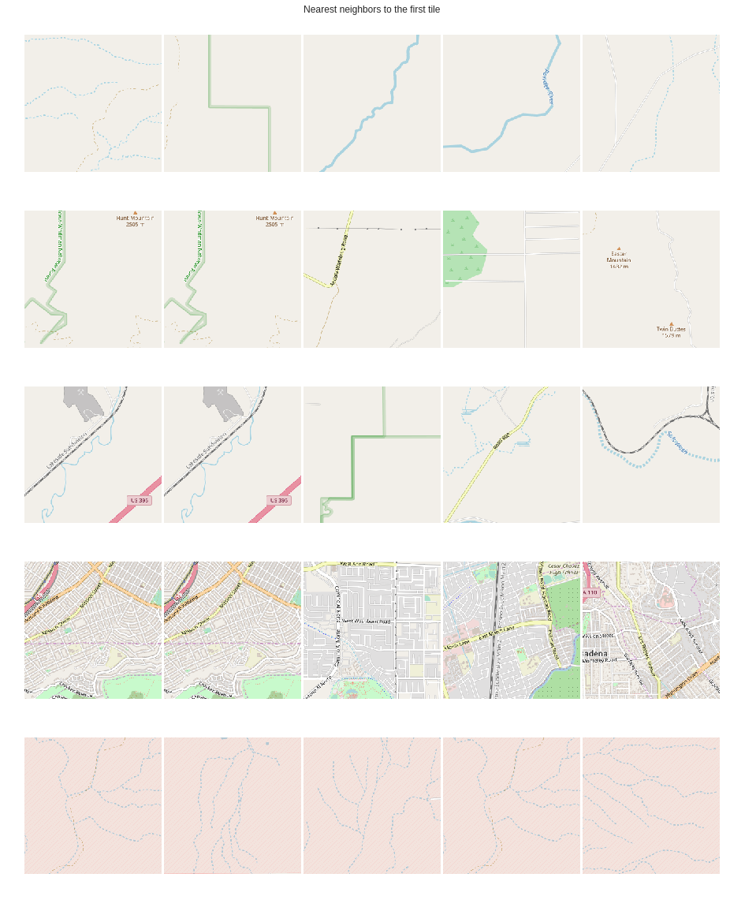
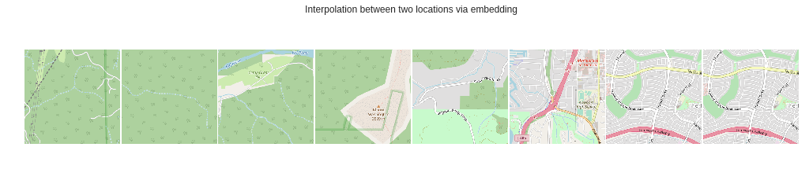

# Loc2Vec Pytorch Mixed Precision Implementation

This project is inspired by this excellent blogpost: https://www.sentiance.com/2018/05/03/venue-mapping/

### Read my [blog post](https://medium.com/@sureshr/loc2vec-a-fast-pytorch-implementation-2b298072e1a7) for implementation details and choices made

#### Note: This implementation requires FP16 support. If your GPU does not have that, just disable it with `amp.init(enable=False)` in trainer.py. You might also have to change the batch size in config.py.

## How to generate tiles from openstreetmap data

Elaborate instructions are provided in the [Readme file](openstreetmap-tile-server/README.md).

Alternatively, you can blindly use load.sh file after changing the path to the pbf file to create the file server. lat2tile.py has a quick utility function to generate all the tiles for the US-west region. You can generate a list of urls using the following. Once you have the following and download the tiles.

    # download the us-west-latest.osm.pbf and change the path in load.sh
    sh load.sh
    python lat2tile.py > urls.txt

    # start the server
    docker run -p 80:80 -v openstreetmap-data:/var/lib/postgresql/10/main -d overv/openstreetmap-tile-server run
    cat urls.txt | xargs -P 10 -n 1 wget -nH -nc -x

## Environment setup (for pytorch and amp) and start training

    conda env create -f  environment.yml
    conda activate loc2vec
    git clone https://github.com/NVIDIA/apex
    cd apex
    pip install -v --no-cache-dir --global-option="--cpp_ext" --global-option="--cuda_ext" .
    cd ..
    python loc2vec

## Credits
- Siamese-Triplet Implementation - https://github.com/adambielski/siamese-triplet
- OpenstreetMap TileServer - https://github.com/Overv/openstreetmap-tile-server

## Wanna Help?
First thanks! Below are a few things to implement. If you are a GIS expert, we can brainstorm a few ideas for collaboration. Open a issue and we can discuss there.

###  TODO:

- [ ] Profile and remove CPU bottleneck
- [x] Add a conda environment file to make it self contained
- [ ] Add ability to suspend and resume from training
- [ ] Ability to save checkpoint even mid-epoch based on number of hard triplets
- [ ] Add support for Fast.ai, esp Stocastic weight averaging & One cycle learning

## Results
#### PCA

#### TSNE

#### Nearest Neighbors (first column is the query image)

#### Interpolation in Embedding Space

