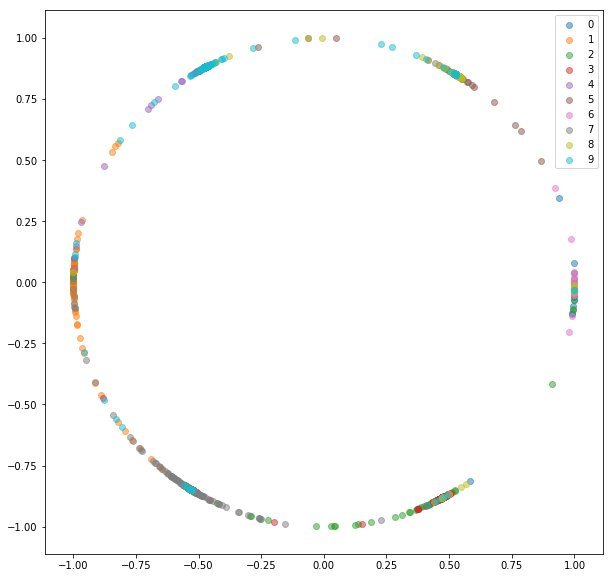

# Online pair/triplet mining

PyTorch implementation of triplet networks for learning embeddings.

 Triplet networks are useful to learn mappings from image to a compact Euclidean space where distances correspond to a measure of similarity [2]. Embeddings trained in such way can be used as features vectors for classification or few-shot learning tasks.

# Installation

Requires [pytorch](http://pytorch.org/) 0.4 with torchvision 0.2.1

# Code structure

- **datasets.py**
  - *TripletMNIST* class - wrapper for a MNIST-like dataset, returning random triplets (anchor, positive and negative)
  - *BalancedBatchSampler* class - BatchSampler for data loader, randomly chooses *n_classes* and *n_samples* from each class based on labels
- **networks.py**
  - *EmbeddingNet* - base network for encoding images into embedding vector
  - *EmbeddingNetL2* - base network  with L2 normalization for encoding images into embedding vector
  - *TripletNet* - wrapper for an embedding network, processes triplets of inputs
- **losses.py**
  - *TripletLoss* - triplet loss for triplets of embeddings
  - *OnlineTripletLoss* - triplet loss for a mini-batch of embeddings. Uses a *TripletSelector* object to find triplets within a mini-batch using ground truth class labels and computes triplet loss
- **trainer.py**
  - *fit* - unified function for training a network with different number of inputs and different types of loss functions
- **metrics.py**
  - Sample metrics that can be used with *fit* function from *trainer.py*
- **utils.py**
  - *TripletSelector* - abstract class defining objects generating triplets based on embeddings and ground truth class labels. Can be used with *OnlineTripletLoss*.
    - *AllTripletSelector*, *HardestNegativeTripletSelector*, *RandomNegativeTripletSelector*, *SemihardNegativeTripletSelector* - TripletSelector implementations

# Examples - MNIST

We'll train embeddings on MNIST dataset. Experiments were run in [jupyter notebook](Experiments_MNIST.ipynb).

We'll go through learning supervised feature embeddings using triplet loss functions on MNIST dataset. This is just for visualization purposes, thus we'll be using 2-dimensional embeddings which isn't the best choice in practice.

For every experiment the same embedding network is used (32 conv 5x5 -> PReLU -> MaxPool 2x2 -> 64 conv 5x5 -> PReLU -> MaxPool 2x2 -> Dense 256 -> PReLU -> Dense 256 -> PReLU -> Dense 2) and we don't perform any hyperparameter search.

## Triplet network

We'll train a triplet network, that takes an anchor, a positive (of same class as an anchor) and negative (of different class than an anchor) examples. The objective is to learn embeddings such that the anchor is closer to the positive example than it is to the negative example by some margin value.

Source: *Schroff, Florian, Dmitry Kalenichenko, and James Philbin. [Facenet: A unified embedding for face recognition and clustering.](https://arxiv.org/abs/1503.03832) CVPR 2015.*

**Triplet loss**:   

*TripletMNIST* class samples a positive and negative example for every possible anchor.

## Online pair/triplet selection - negative mining

There are couple of problems with siamese and triplet networks:
1. The **number of possible triplets** grows **cubically** with the number of examples. It's infeasible to process them all and the training converges slowly.
2. We generate pairs/triplets *randomly*. As the training continues, more and more pairs/triplets are **easy** to deal with (their loss value is very small or even 0), *preventing the network from training*. We need to provide the network with **hard examples**.
3. Each image that is fed to the network is used only for computation of contrastive/triplet loss for only one pair/triplet. The computation is somewhat wasted; once the embedding is computed, it could be reused for many pairs/triplets.

To deal with these issues efficiently, we'll feed a network with standard mini-batches as we did for classification. The loss function will be responsible for selection of hard pairs and triplets within mini-batch. If we feed the network with 16 images per 10 classes, we can process up to 159\*160/2 = 12720 pairs and 10\*16\*15/2\*(9\*16) = 172800 triplets, compared to 80 pairs and 53 triplets in previous implementation.

Usually it's not the best idea to process all possible pairs or triplets within a mini-batch.

### Online triplet selection

We'll feed a network with mini-batches just like with online pair selection. There are couple of strategies we can use for triplet selection given labels and predicted embeddings:

- All possible triplets (might be too many)
- Hardest negative for each positive pair (will result in the same negative for each anchor)
- Random hard negative for each positive pair (consider only triplets with positive triplet loss value)
- Semi-hard negative for each positive pair (similar to [2])

The strategy for triplet selection must be chosen carefully. A bad strategy might lead to inefficient training or, even worse, to model collapsing (all embeddings ending up having the same values).

Here's what we got with random hard negatives for each positive pair.

**Training set:**

**Test set:**

Here's what we got with random hard negatives for each positive pair with L2 normalization.

**Training set:**

**Test set:**

# TODO

- [ ] Optimize triplet selection

# References

[1] Raia Hadsell, Sumit Chopra, Yann LeCun, [Dimensionality reduction by learning an invariant mapping](http://yann.lecun.com/exdb/publis/pdf/hadsell-chopra-lecun-06.pdf), CVPR 2006

